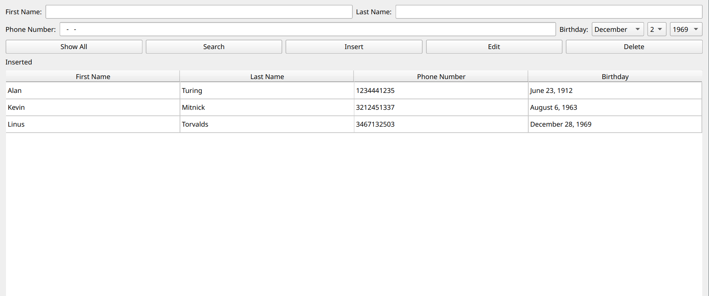
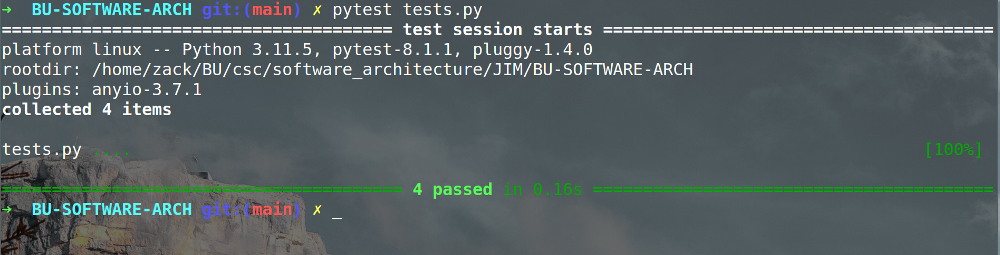

# BU-SOFTWARE-ARCH

## Prompt

```
Hey, my name's Jim.

I have a problem. I can't remember phone numbers.

Can you help me?

Here's what I need:

    Some app to remember phone numbers for me
    I need to be able to enter, retrieve, and edit contacts
    I need to know each contacts first and last name and their phone number
    I need to be able to search my contacts
```

## Our Goals
Use tkinter to make a simple and easy to use GUI that uses our sqlite database.

## Database
SQLITE database called `phone_numbers.db`

there is a table called contacts

created with the command below.
```
create table contacts ( 
    first_name TEXT NOT NULL,
    last_name TEXT NOT NULL,
    phone TEXT NOT NULL UNIQUE,
    birth TEXT NOT NULL
);

```
This is what we will use to update, edit, and insert contacts.

Let's create a few default values

```
INSERT INTO contacts (first_name, last_name, phone) VALUES('Alan', 'Turing', '1234561337', 'June 23, 1912');
INSERT INTO contacts (first_name, last_name, phone) VALUES('Linus', 'Torvalds', '4445551337', 'December 28th, 1969');
INSERT INTO contacts (first_name, last_name, phone) VALUES('Kevin', 'Mitnick',  '3133731337', 'August 6th, 1963');
```

## UI



## Testing
There are some tests in `tests.py`
These test how we interact with the database and ensure that our birthday validation is correct


## Running
To install python libraries
`python3 -m pip install -r requirements.txt`
To run application
`python3 jim_application.py`